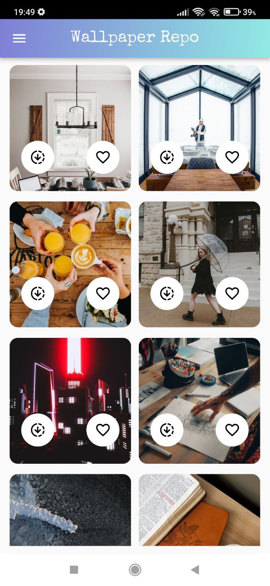

# FLUTTER/DART  Unsplash Api WALLPAPER REPOSITORY Shared Preferences
-----------------------

---------------------
## Used Packages

- image_downloader: 
- google_fonts: 
- http: 
- flutter_staggered_grid_view: 
- shared_preferences: 
- permission_handler:

## Screenshots

